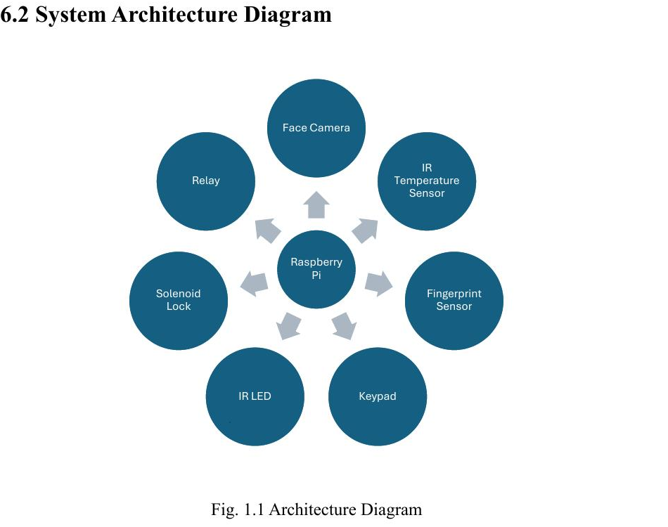
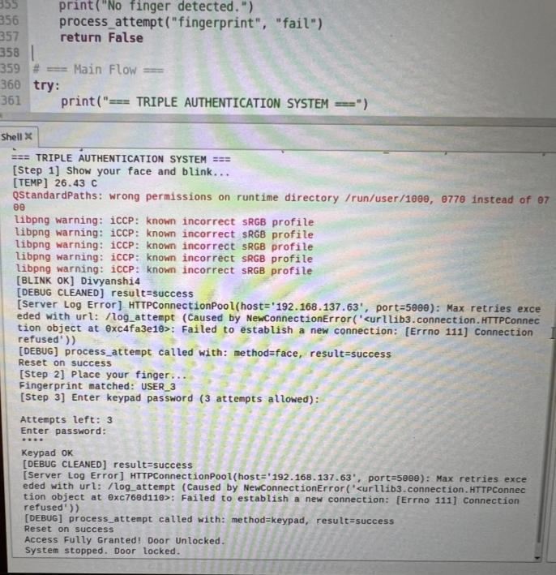
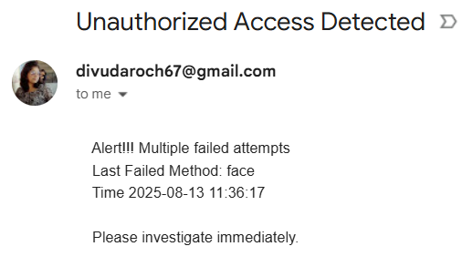

# Automatic Door Triple Authentication

A Raspberry Pi 4–based smart door security system that uses **three layers of biometric and knowledge-based authentication** — facial recognition with anti-spoofing (blink + infrared temperature detection), fingerprint scanning, and an encrypted keypad PIN — before releasing a solenoid door lock. Built as an EECE 8041 Engineering Capstone Project at Conestoga College.

## Overview

Single-factor security systems (face-only, fingerprint-only, or PIN-only) are vulnerable to spoofing: printed photos, screen replays, lifted fingerprints, or shoulder-surfed PINs. This project combines **three independent authentication factors** with **built-in spoof detection**, and supports **multiple registered users**, including a dedicated accessible pathway for users with physical impairments.

## How It Works

```
   [ Face + Blink + IR Temp Check ]  →  [ Fingerprint Scan ]  →  [ Keypad PIN ]  →  🔓 Solenoid Unlocks
                 ↓                              ↓                      ↓
        3 Failed Attempts?             3 Failed Attempts?      3 Failed Attempts?
                 ↓                              ↓                      ↓
                     📧 Email Alert: date, time & which stage failed
```

1. **Step 1 – Face Recognition + Anti-Spoofing**
   A PiCamera2 captures the user's face. Facial landmarks are detected using **dlib** (68-point model) to verify **eye-blink liveness** (Eye Aspect Ratio method), while an **MLX90614 infrared temperature sensor** confirms the surface is giving off a real human heat signature — rejecting printed photos or screen replays.

2. **Step 2 – Fingerprint Scan**
   If the face check passes, an **R307 fingerprint sensor** (connected via UART) matches the scanned print against enrolled templates.

3. **Step 3 – Keypad PIN**
   The user enters a 4-digit PIN on a 4×4 matrix keypad. The PIN is stored using **Fernet symmetric encryption** and decrypted only at runtime for verification.

4. **Accessible User Pathway**
   Users listed in `accessible_users.txt` (e.g. individuals with mobility impairments) can unlock the door with **face recognition alone**, provided both the blink and temperature spoof checks pass — fingerprint and keypad steps are skipped for them.

5. **Access Granted / Denied**
   - ✅ If authentication passes → a **relay module triggers a 12V solenoid lock** to open the door.
   - ❌ If any stage fails **3 times in a row** → an **email alert** is sent via SMTP, identifying the failed stage (face/fingerprint/keypad) along with the **date and timestamp** of the attempt.

6. **Logging**
   Every attempt (user, timestamp, stage, result) is logged to a local **SQLite3 database** via a lightweight **Flask** server for later review.

## System Architecture



*The Raspberry Pi 4 sits at the center, coordinating the face camera, IR temperature sensor, fingerprint sensor, keypad, IR LED, relay, and solenoid lock.*

## Hardware Used

- Raspberry Pi 4 (4GB RAM)
- PiCamera2
- IR LED (for reliable blink detection in varied lighting)
- MLX90614 infrared temperature sensor (I2C)
- R307 fingerprint sensor (UART)
- 4×4 matrix keypad
- Relay module + 12V solenoid door lock
- Breadboard, jumper wires, power supply

## Software & Libraries

- Python 3.11
- OpenCV + dlib (face detection, facial landmarks, blink detection)
- RPi.GPIO / gpiozero (keypad, relay, IR LED control)
- pyserial (UART communication with fingerprint sensor)
- smbus2 (I2C communication with temperature sensor)
- cryptography (Fernet symmetric encryption for PIN storage)
- Flask + SQLite3 (local authentication logging)
- smtplib (email alerts on repeated failures)

## Installation & Setup

```bash
# Clone the repository
git clone https://github.com/divudaroch67/automatic-door-triple-authentication.git
cd automatic-door-triple-authentication

# Install dependencies
pip install -r requirements.txt

# Run the system
python triple_auth.py
```

> **Note:** Make sure the Pi Camera, fingerprint sensor, and keypad are correctly wired to your Raspberry Pi's GPIO pins before running the script. (Add a wiring diagram or pin mapping here if available.)

## Demo

**Successful authentication run (terminal output):**



**Email alert on repeated failure:**



Full video demos:
- [Video 1](./Video1.mp4)
- [Video 2](./Video2.mp4)

## Project Report

A detailed write-up of the project, including design decisions and testing, is available in [formal project report.pdf](./formal%20project%20report.pdf).

## Future Improvements

- Mobile app / push notification integration for alerts
- Persistent access log (stored to file/database, not just email)
- Remote unlock/monitoring via web dashboard
- Auto-relock timer after successful unlock

## License

This project is open source. Feel free to use and modify it for educational purposes.
